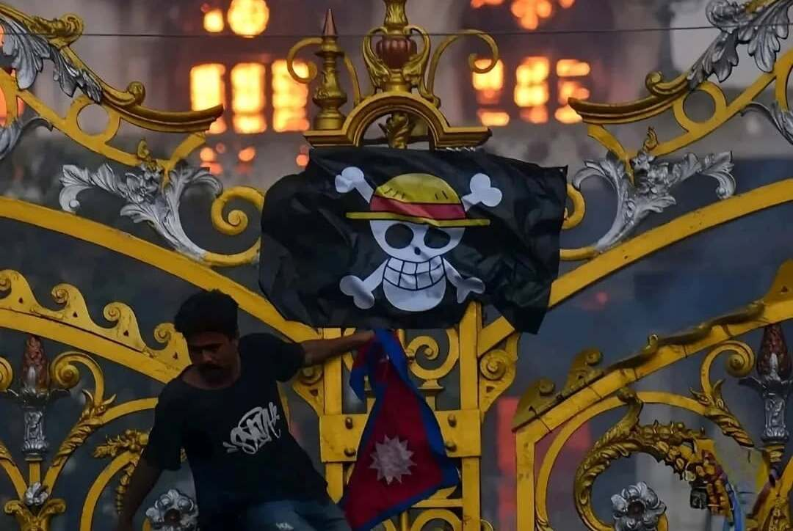

# Protest In Nepal
Gen-z revolution of nepal occured on 8th september, 2025. The protest began when the government attempted to silence the nation's voice by enacting a social media ban across the country. The protest was led by young individuals who recognized themselves as Generation z "Gen-z". The Gen-z's led the protest carrying the straw hat jolly roger flag. It reminded me of when I was in school around 2016-17, when my friends and I used to analyze one piece's story arcs, and some of my classmates found it boring and debated with us about the shallowness of the plot and how it carries no relevance to the real world. And in present day I am witnessing mass individuals waving straw hat jolly roger flag overthrowing the entire government in just 2 days. It felt surreal to me that Eiichiro Oda's masterpiece "One piece" has made such influence in the real world.

### The Straw hat Jolly Roger In Protest

It is represented as a symbol of protest against the government. A flag that significantly inspired the youth to engage in activism. People were seen raising the flag onto the burnt government buildings as an act of defiance against the government. The connection between Gen Z and the flag holds a similar resemblance to the Straw Hat Pirates. The crew is labeled one of the worst generations by the world government, and similarly, the government of Nepal views Gen Z as weak, incapable, and inexperienced. The government is composed of older individuals who establish political parties through nepotism and are deeply entrenched in corruption. They hold all the power and couldn't reform anything in the country. The flag represents the unity, strength, fearlessness, and cheerful nature of Generation Z, like the Straw Hat Pirates. Gen Z won't tolerate injustice. The Straw Hat Jolly Roger is not a fictional material anymore; This emblem has become a symbol of hope and resistance for those fighting against oppression. As more people rally behind the ideals of freedom and justice, the legacy of the Straw Hats continues to inspire new generations.

### Background on One piece

Formed by the decision of 20 ancient kingdoms in the past, it gave birth to a decentralized entity with no single ruler, The World Government. The world government governs the seas and kingdoms affiliated to them. The descendants of 19 out of those 20 kingdoms are the celestial dragons. The government functions on the likes of celestial dragons, evil people that try to play god and eventually shape the destiny of one kingdom. They are regarded as supreme beings who reside at the pinnacle of other beings. The Celestial Dragons don't even breathe the same air as the normal people; they live at the heights of the seas, enslave people and sell them, make them their servants, abuse them, or send them to forced labor for the entirety of their lives. They control the seas and kingdoms through government, and anybody who tries to oppose them has to deal with the immense forces of the government.

Modifying and erasing the history to keep the public away from the truth; restrict people from researching the history and the whereabouts of the ancient weapons that have the potential to be used against their advantages are the primary concerns of the world government. To keep everything in their control to make the public weak and prevent them from overthrowing the superpower.

The pirates are the natural enemies of the world government in the world of One Piece. Luffy's crew, the 'Straw Hat Pirates', are pirates of the New World and are called 'The pirates of the worst generation'. The crew is ultimately after the greatest treasure mankind has to offer, the One Piece. Wealth, money, fame everything is inclusive to the treasure, One Piece. On their journey to finding One Piece, the crew ventures along the infinite horizons of seas, deciphering the secrets that the government doesn't want anyone to find out about, learning about the ancient weapons and the truth about the world government. The Straw Hats revolted against the world government on numerous occasions. They, alongside the people of the kingdoms, helped them to overthrow the tyranny of the world government.