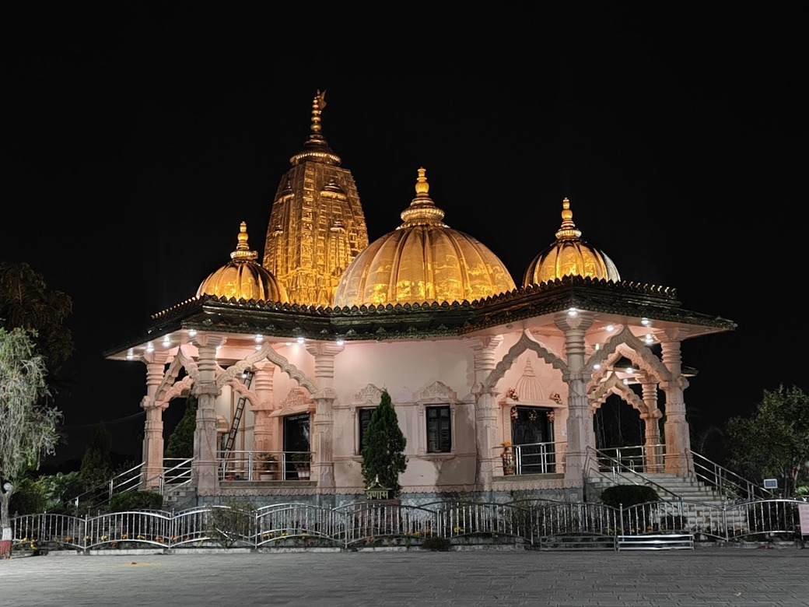

>I have learned to walk: since then I have run. I have learned to fly: since then I do not have to be pushed in order to move. Now I am nimble, now I fly, now I see myself under myself, now a god dances within me  - Friedrich Nietzsche

There is little to no difference between having a worse hangover and trying to wake up in the morning for a person who is not programmed to wake up early every day. I was wrapped up like a fat burrito in bed, experiencing a stiff neck pain that shot down between my shoulder blades. My struggle isn't a light one. Nevertheless, I would wake up to the sound of Pac's music, "Starrin' at the World Through My Rearview," set up as my main alarm on my old Samsung. It was my favorite song back in the day; matter of fact, it is still very close to me. I was a big-time Tupac listener then, deeply moved by Pac's music, and I admire Tupac for the person he is and always keeping it real. I would not stop the alarm and let it play for a while until I was on my feet. Then suddenly everything goes super quiet; it's cold and dark. I drag myself up to the curtains to slide them open. You would anticipate it would be rays of light from the sun, birds chirping, the smell of incense, people chatting in the background, or the radio playing somewhere nearby, but all I see are grey plastered unfinished buildings separated by a few feet, creating a little alleyway between them.

I would open the window and kneel before the sill and look atop between the alleyway. If I had woken up late enough, the sun rays would have just hit my face, but it was blue outside, and there was not a shred of light. A breeze would deepen the chill already settling on my face, and I could feel the skin on my face kind of tighten. A few breaths in, a gulp of water from the jar kept overnight at my dusty table, a splash of freezing water onto my face, and my good old hoodie from years ago. Sometimes if I had more time, I would entertain myself with a cup of warm milk or black coffee with jaggery. The thing is I take pride in my precise timing for the rendezvous, not to mistake it for my ego; rather, it is my way of conveying my upmost respect to the deserving individual and not wasting their time.

I leave my place and stroll through the streets early amidst the fog all around. I hardly see anyone and anything in the distance except for the dairy bus that delivers milk every day before sunrise. Local vendors would have just opened their stores, lit a lamp to God, burned incense, played some hymns, and gotten busy with daily chores. A light walk into and out, upstairs and downstairs, right and left, and I had made it to the point where my friend would appear just shortly after. My friend and I have known each other for a long time. He is a real one, humble yet very strong, both physically and mentally, and always inspiring me to do better. Our goal was a minimum of 10k steps every morning. So we used to walk on the riverside trail along the river, which was being made at that time; it was muddy and deranged, and the streets beside the riverbank were covered with dust. We'd put on our masks for some distance until the air was clear. 

We would talk endlessly along the way about technology, politics, philosophy, biology, psychology, nature, fiction, and what not. My friend is an interesting person to have a conversation with; he has never failed to get me hooked on his talks. A little farther there were tents put up by the men working on building the riverside trail. Their wives and children would come in the morning, bringing them breakfast, a blend of rice and dal. Such cold and terrible living conditions with minimal wages, yet these men contribute such great labor for the society. Life is not easy for everyone; one should be grateful for his easy life and stay humble. Through bushes and trees we would make our way to a bridge and cross the river and head to the temple on the little hill on the opposite side. breathless until we reach the temple, and there on top of a hill, you could see the whole city in the morning with the sun, which is still vibrant red and has just risen.

I cannot put in words the tranquility of that place. Each time I am there, I lose myself completely as though invisible weights lift from my shoulders, my chest grows light, and my senses awaken. Time slows, awareness heightens, and I am suspended in a quiet, enigmatic state. We would walk around in the temple for a while before making our way back, parting ways until our next walk. The slow, cold, and quiet morning would soon give way to a warm and bustling day.

